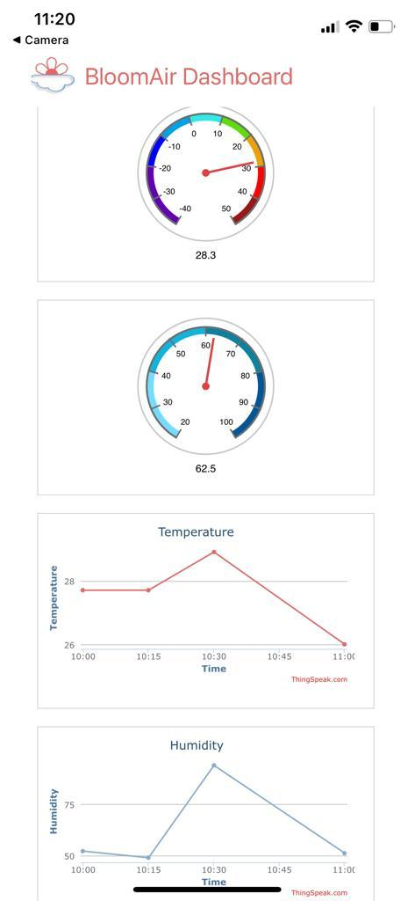

# BloomAir
Bloom Air

A flower blooms the air in a room. A bunch of flowers blooms the air of a neighbourhood.

BloomAir is an IoT powered solution for a cleaner and conscious living developed at the Participatory Resilience '22 hackathon at ETH Zürich. The project contains three things:

1.	Sensors:
Atmospheric sensors housed in a vase, whose readings are intuitively relayed to the user by means of a "dead" or "alive" artificial 3D printed flower.

2.	Client-side app and alert system:
The app lets users of BloomAir devices check the air quality measurements at their home from wherever they are. Based on data from neighbouring BloomAir devices, users are notified of a possible air quality threat based on predictions of a machine learning algorithm.

3.	Analytics dashboard:
We aggregate data from all BloomAir devices and visualize it on Google Maps to provide a big picture view of indoor air quality trends. Also shown are any emerging anomalies in real time.

The purpose of the whole project is to provide a user-friendly air quality measuring device which provides all necessary information to improve the room climate of its owner. It’s a friendly reminder to regularly open the window to let fresh air in and in case of an emergency it not only alerts the affected people but also the officials who can respond quicker.

## Features

- Appearance (3D print)
    - Flower
    - Stem tubes
    - Motor base
    - Other parts

- Peripherals
    - Motor
    - Sensor
    - Raspberry Pi

- Cloud storage
    - AWS storage
    - ThingSpeak

- Management
    - HTML dashboard
    - Google Maps display
    - Anomaly detection and alarm
    - Mobile application

## Setup and technicals
`pigpio` and `pigpio-dht` are required to communicate with motor and sensor, and can be installed via `pip`. Running `main.py` will take control of the mechanism and sensor while streaming the former's data to the ThingSpeak and AWS servers every ten seconds. Sensor polling will occur every 2 seconds. Script parameters can be altered to realize different configurations, and the straightforward sensor interface (in `raspi/peripherals.py`) allows for easy implementation of more complex sensing protocols. The servo motor can be configured for "analog" or "digital" output to obtain the optimal data visualization mode for the sensed quantities of interest. The control daemon `pigpiod` is run at startup via `/etc/rc.local`.

## Environment
First, install the environment for this repository using

`conda env create -f environment.yml`

Then activate the environment:
`conda activate bloomAir`

### Google Map
For this part, we first do data simulation every 1 second, then we use `draw_map.py` to show real-time data changes as well as to do real-time anomaly detection.
To run the data simulation, we do the following command:

`python google_map/data_simulation.py`

Then the data simulation would last for 1000 secends. We open another terminal to do google map visulization, remember to activate the environment first and cd to google_map directory:

`bokeh serve --show draw_map.py`

## Demo

Alive plant (acceptable air quality)

Dead plant (bad air)

Original render 

Old motor style (requires some tuning)

Dashboard app 

Simulated sensor website 

# Contributors
- Andreas Regli - aregli@student.ethz.ch
- Feichi Lu - feiclu@student.ethz.ch
- Filippo Miserocchi - fmiserocchi@student.ethz.ch
- Omkar Zade - omzade@student.ethz.ch
